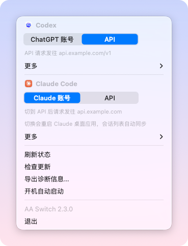
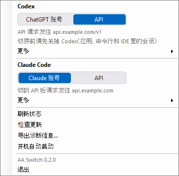
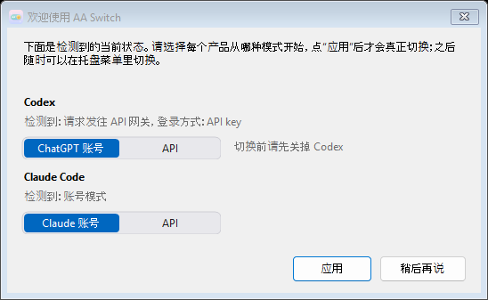
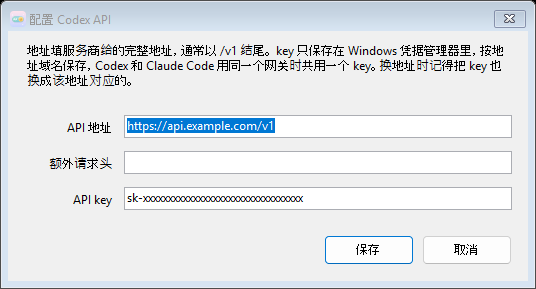

  

<h1 align="center">AA Switch</h1>

  Switch Codex and Claude Code between your account and your own API. 
  One click. Nothing lost.

  <a href="https://aaswitch.omniapexroute.com">Website</a>
  &nbsp;·&nbsp;
  <a href="README.zh-CN.md">中文</a>

---

## Why "AA"?

**AA** stands for **API – Account**. AA Switch does exactly one thing: it flips Codex and Claude Code between your own **API** key and your official **Account**.

## What it does

AA Switch lives in your Mac's menu bar (or the Windows system tray). Open it to see which side Codex and Claude Code are each on right now, and click to flip.

<table align="center">
  <tr>
    <td align="center" valign="top"> macOS</td>
    <td align="center" valign="top"> Windows</td>
  </tr>
</table>

The interface is in Chinese. Each product has one Account | API toggle; the lit half is the current mode.

- **Two modes, one click.** Use your subscription, or route through your own API key. Switch back and forth as often as you like; Codex and Claude Code flip independently.
- **Your history comes with you.** Every conversation stays visible and usable on both sides.
- **No re-login.** AA Switch remembers your ChatGPT session, so coming back to your account doesn't mean signing in again. Your Claude account login is never touched at all.
- **Safe by default.** Settings are backed up before every switch and restored automatically if anything goes wrong.
- **One key, both tools.** Enter a gateway's key once; Codex and Claude Code share it.

## Install

### macOS

1. Download **AA Switch.dmg** from [aaswitch.omniapexroute.com](https://aaswitch.omniapexroute.com) (or from the [Releases](https://github.com/yhq1998/AA-switch/releases) page).
2. Open the dmg, drag **AA Switch** into Applications and open it from there. Double-clicking it inside the dmg works too: it offers to install itself into Applications and ejects the disk image.
3. Look for the little switch at the top right of your screen.

Requires macOS 13 or later on either Intel or Apple silicon (the app is a universal binary), and at least one of: the Codex desktop app, or Claude Code (terminal or IDE extension).

### Windows

1. Download **AA Switch.exe** from [aaswitch.omniapexroute.com](https://aaswitch.omniapexroute.com) (or from the [Releases](https://github.com/yhq1998/AA-switch/releases) page).
2. Put it somewhere permanent (Documents, `D:\Tools`, …) and double-click it. There is no installer and no runtime to install.
3. Look for the smiley icon in the system tray at the bottom right (it may be tucked under **^**; drag it out if you like).

Requires Windows 10 or 11 (64-bit). The Windows build is not code-signed yet, so SmartScreen may block the first run: click **More info → Run anyway**.
You need at least one of: Codex (CLI or IDE extension), or Claude Code (terminal or IDE extension).

  

## Use

Click the icon in the menu bar (the system tray on Windows).

- The menu has a **Codex** group and a **Claude Code** group, each with an **Account | API** toggle. The lit half is the current mode, and the small text underneath says where requests are going.
- Click the other half to switch. On macOS, Codex closes and reopens by itself; it takes a few seconds. Claude Code needs no restart: new sessions in the terminal and in IDE extensions pick it up immediately.
- The first time you go to API, AA Switch asks for your API address and key, and tries the key against that address before saving. The key is stored in the macOS Keychain (Windows: Credential Manager) and never written to a file.
- The first time you switch Codex, macOS asks whether AA Switch may control Codex. Choose **Allow**; it needs this to restart Codex.

  

Turn on **Launch at login** in the menu and AA Switch is always there. When a new version is out, the bottom of the menu says so; one click updates in place.

### What's different on Windows, for now

- Close Codex yourself (app, CLI and IDE sessions) before switching it; AA Switch does not quit and reopen it for you. If something is still running it tells you and changes nothing.
- The Claude desktop app's Code tab cannot be moved to API yet (see the last item under "Good to know"). Claude Code in the terminal and in IDE extensions is unaffected.
- Launch at login remembers where the exe was when you turned it on, so don't move the exe afterwards.

## Good to know

- If Codex is also running in a terminal or an IDE, close those first. AA Switch will remind you.
- If Codex asks you to sign in after switching back to your account, your session simply expired. Sign in once and you're set.
- Backups taken before every switch are kept in `~/.codex/codex-mode-backups` and `~/.claude/claude-mode-backups` (on Windows `~` is `C:\Users\you`; the latest 20). **Open backups** under each product's **More** menu takes you there.
- While Claude Code is on API, features that need your Claude account (publishing Artifacts, cloud sessions, /schedule, connectors) are unavailable until you switch back.
- On macOS, the Claude Code switch covers both the terminal / IDE extensions and the Claude desktop app's Code tab. The desktop app forces its own login credential onto the Code sessions it starts, so switching to API also moves the whole desktop app into its third-party inference mode and restarts it, syncing the session list across. In API mode the desktop app's regular Chat is unavailable; switching back to the account restores it.

---

Developers and maintainers: see [DEVELOPMENT.md](DEVELOPMENT.md).
